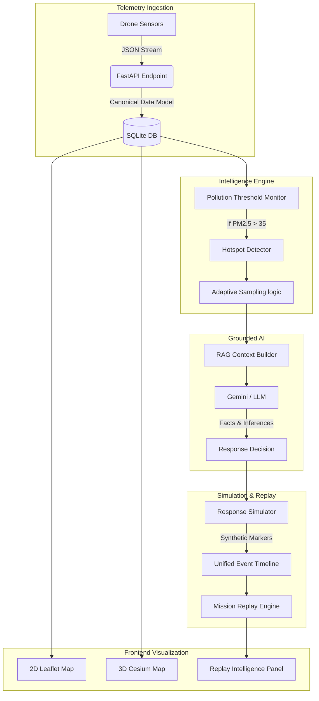

# QUDRACOPTER System Architecture

## Core Data Flow

## Component Architecture

1. **Telemetry Ingestion Layer:** Exposes `/api/telemetry` via FastAPI, enforces the `EnvironmentalRecord` schema.
2. **Decision Engine:** `adaptive_sampling.py` and `pollution_intelligence.py` analyze rolling averages and distance heuristics to trigger localized events.
3. **AI Grounding Layer:** `grounding.py` filters raw LLM responses. Any numerical claim must be sourced from the `retrieved_evidence`.
4. **Simulator:** `ResponseSimulation` creates purely synthetic events (with explicit tags) to visualize the AI's recommendations without actual drone movement.
5. **Replay Interface:** A highly-synchronized React component that parses `timestamp` logic to "time travel" through the mission.
